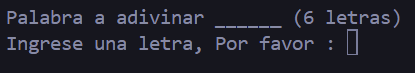
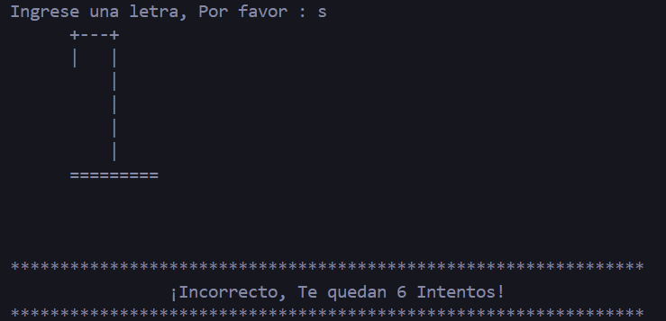
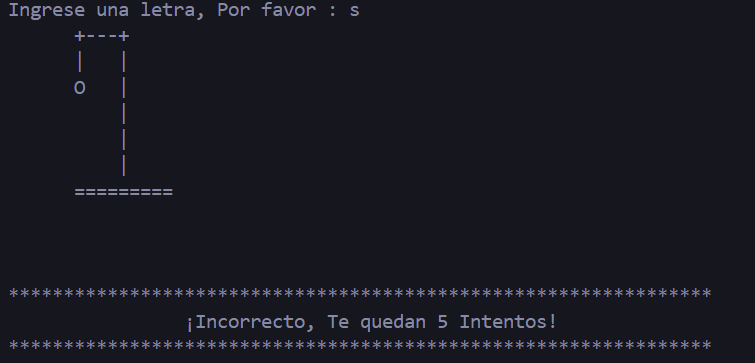
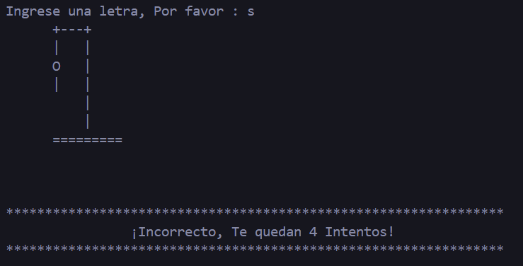
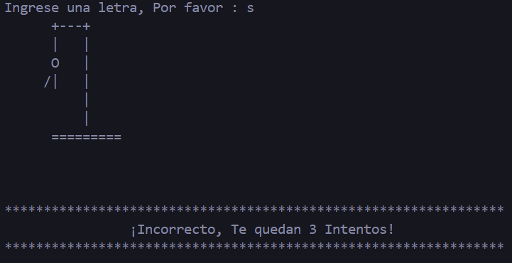
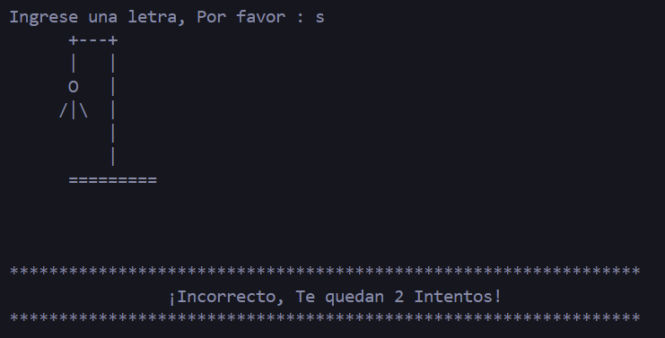
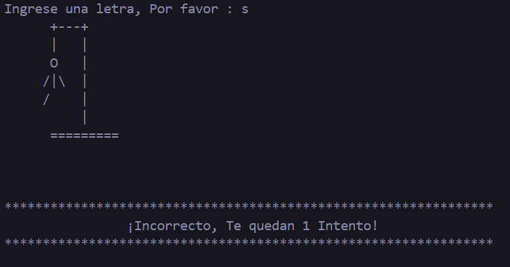
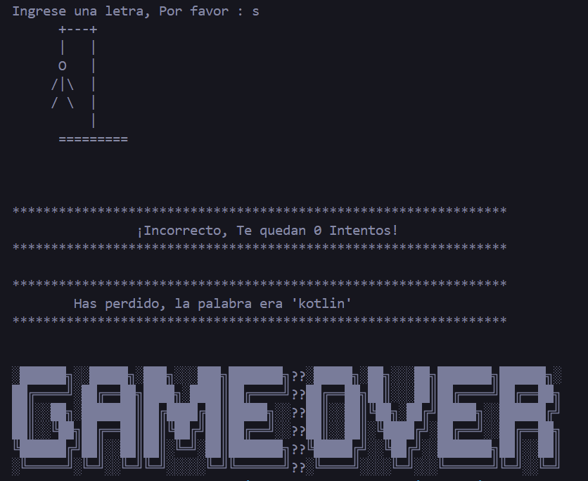
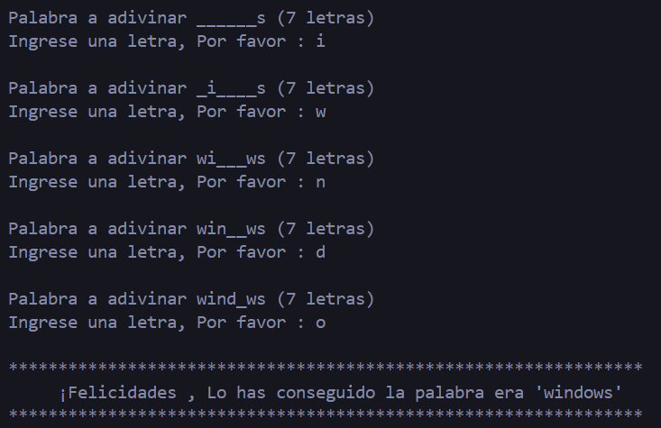

# #Juego Ahorcado Java

se realizo un juego de ahorcado en el lenguaje de progrmacion Java donde uno debe de ir colocando letra a letra en la consola y tiene como limite 7 intentos
si logra adivinar la palabra secreta este ganara de lon contrario perdera

## ¿Que Herramientas se utilizaron?

1.  Clase Scanner para la entrada de datos
2.  Declaraciones y asignaciones
3.  Arreglos
4.  Estructura Iterativa tipo bucle
5.  Clases String y sus metodos (valueOf, charAt, length, format)
6.  Estructura de conttrol condicional

## #Capturas Funcionamiento

